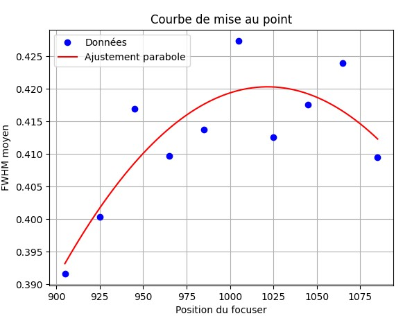

# Focuser ascom 

script to test a focus algorithm to be implemented with ASCOM Alpaga.

Simulate stars and apply blur based on focus position.

First algorithm based on global contrast to find an initial position.
Second algorithm based on stars sharpness, but need to have an initial position not too far from focus.

